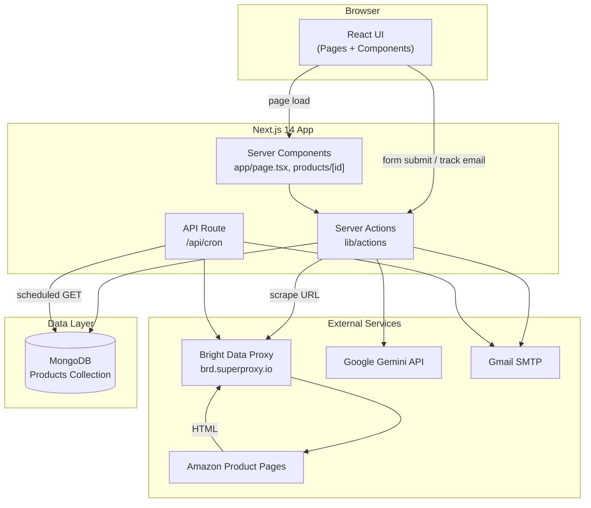
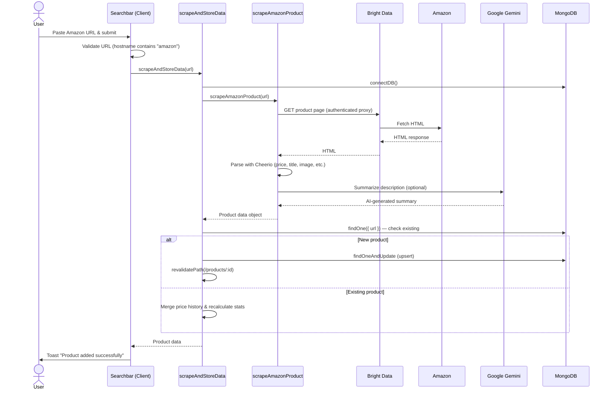
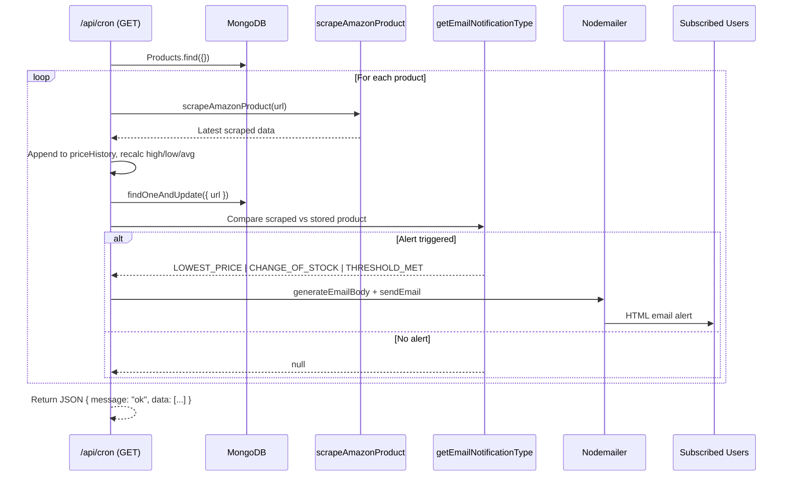
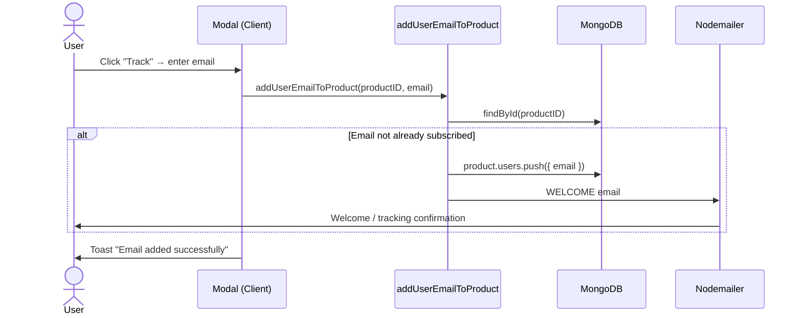
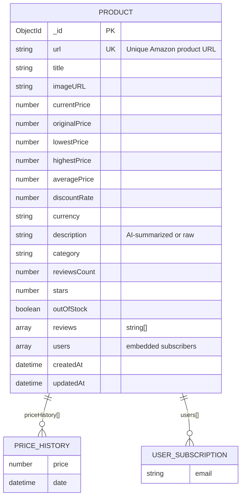
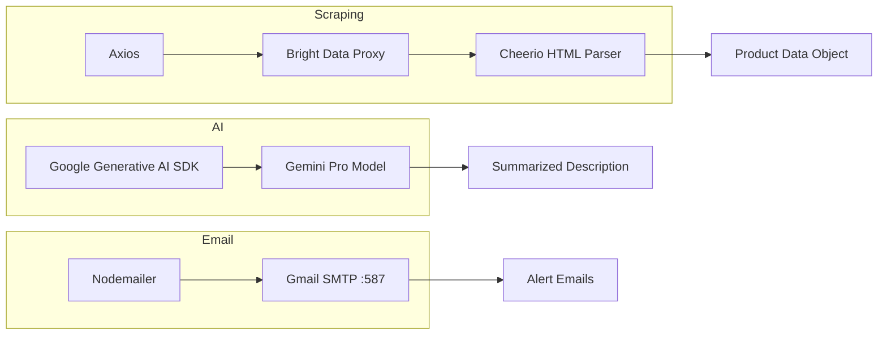
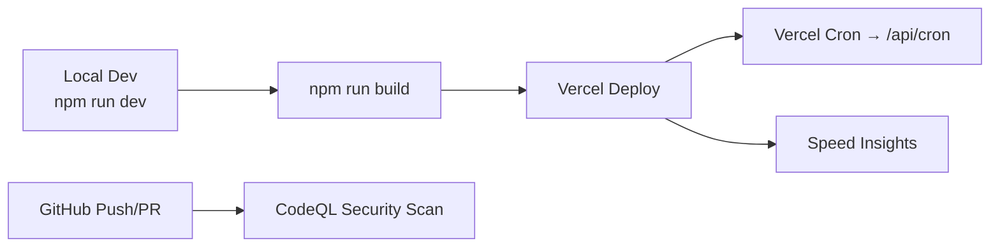

# PriceTrackEr — Codebase Details

PriceTrackEr is a **Next.js 14** web application that tracks Amazon product prices, stores price history in **MongoDB**, and sends email alerts when prices drop, stock changes, or discount thresholds are met.

---

## Table of Contents

1. [Tech Stack](#tech-stack)
2. [Project Structure](#project-structure)
3. [System Architecture](#system-architecture)
4. [Data Flows](#data-flows)
5. [Database Schema](#database-schema)
6. [Core Features](#core-features)
7. [Server Actions & API Routes](#server-actions--api-routes)
8. [External Services](#external-services)
9. [Environment Variables](#environment-variables)
10. [UI Components](#ui-components)
11. [Deployment & CI](#deployment--ci)
12. [Known Notes](#known-notes)

---

## Tech Stack

| Layer | Technology |
|-------|------------|
| Framework | Next.js 14 (App Router) |
| Language | TypeScript |
| UI | React 18, Tailwind CSS, MUI, Headless UI |
| Database | MongoDB via Mongoose 8 |
| Scraping | Axios + Cheerio (via Bright Data proxy) |
| AI | Google Gemini (`gemini-pro`) for product descriptions |
| Email | Nodemailer (Gmail SMTP) |
| Hosting | Vercel (Speed Insights enabled) |
| Security | GitHub CodeQL workflow |

---

## Project Structure

```
PriceTrackEr/
├── app/                          # Next.js App Router
│   ├── api/cron/route.ts         # Scheduled price refresh & email alerts
│   ├── products/[id]/page.tsx    # Product detail page
│   ├── page.tsx                  # Home page (search + trending products)
│   ├── layout.tsx                # Root layout (Navbar, toasts, analytics)
│   └── globals.css               # Global styles
├── components/                   # React UI components
│   ├── Searchbar.tsx             # Amazon URL input & scrape trigger
│   ├── Modal.tsx                 # Email subscription modal
│   ├── ProductCard.tsx           # Product list card
│   ├── PriceInfoCard.tsx         # Price stat card (current/avg/high/low)
│   ├── Navbar.tsx
│   ├── Herocarousel.tsx
│   └── CopyToClipboard.tsx
├── lib/
│   ├── actions/index.ts          # Next.js Server Actions (CRUD + email)
│   ├── scraper/index.ts          # Amazon HTML scraper
│   ├── nodemailer/index.ts       # Email templates & sending
│   ├── mongoose.ts               # MongoDB connection singleton
│   ├── models/product.model.ts   # Mongoose Product schema
│   └── utils/                    # HTML parsing & price helpers
├── types/index.ts                # Shared TypeScript types
└── public/assets/                # Icons & static assets
```

---

## System Architecture

High-level view of how the application connects to external services and the database.



---

## Data Flows

### 1. Add / Track a Product (User Search)

When a user pastes an Amazon URL on the home page, the app scrapes the product and stores it in MongoDB.



### 2. Email Price Alerts (Cron Job)

The `/api/cron` route re-scrapes all tracked products and notifies subscribed users when alert conditions are met.



### 3. Subscribe to Price Alerts



---

## Database Schema



### Price History & Stats

Each scrape appends a new `{ price, date }` entry to `priceHistory`. Aggregates are recalculated using:

- `getLowestPrice()` — minimum price in history
- `getHighestPrice()` — maximum price in history
- `getAveragePrice()` — arithmetic mean of all recorded prices

---

## Core Features

| Feature | Description |
|---------|-------------|
| **Product Search** | Paste an Amazon URL on the home page to scrape and store product data |
| **Trending Products** | Home page lists all products from the database |
| **Product Details** | `/products/[id]` shows image, pricing, AI description, price stats, and similar products |
| **Price Tracking** | Users subscribe via email on the product detail page |
| **Email Alerts** | Cron job sends alerts for lowest price, back-in-stock, or ≥40% discount |
| **AI Descriptions** | Gemini summarizes long Amazon descriptions into a short paragraph |
| **Similar Products** | Shows up to 3 products in the same category |

### Email Alert Triggers

| Type | Condition |
|------|-----------|
| `LOWEST_PRICE` | Scraped price < previous lowest in price history |
| `CHANGE_OF_STOCK` | Product was out of stock, now in stock |
| `THRESHOLD_MET` | Discount rate ≥ 40% |
| `WELCOME` | Sent once when a user first subscribes |

---

## Server Actions & API Routes

### Server Actions (`lib/actions/index.ts`)

| Function | Purpose |
|----------|---------|
| `scrapeAndStoreData(url)` | Scrape Amazon, create or merge product in DB |
| `getProductById(id)` | Fetch product by MongoDB `_id` |
| `getProductByUrl(url)` | Fetch product by Amazon URL |
| `getAllProducts()` | List all products (home page) |
| `getSimilarProducts(id)` | Up to 3 products in same category |
| `addUserEmailToProduct(id, email)` | Subscribe user & send welcome email |

### API Routes

| Route | Method | Purpose |
|-------|--------|---------|
| `/api/cron` | GET | Re-scrape all products, update DB, send alert emails |

> **Note:** Configure a Vercel Cron Job (or external scheduler) to hit `/api/cron` on a schedule for automated price monitoring.

---

## External Services



| Service | Role | Config |
|---------|------|--------|
| **Bright Data** | Rotating proxy to fetch Amazon pages without blocks | `BRIGHT_DATA_USERNAME`, `BRIGHT_DATA_PASSWORD`, `BRIGHT_DATA_PORT` |
| **Google Gemini** | Summarizes product descriptions | `GEMINI_API_KEY` |
| **Gmail SMTP** | Sends tracking & alert emails | `EMAIL_ADDRESS`, `EMAIL_PASSWORD` |
| **MongoDB Atlas** | Persistent product & subscriber storage | `MONGO_URI` |

---

## Environment Variables

Create a `.env.local` file in the project root:

```env
# Database
MONGO_URI=mongodb+srv://<user>:<password>@<cluster>.mongodb.net/<db>

# Bright Data (Amazon scraping proxy)
BRIGHT_DATA_USERNAME=your_username
BRIGHT_DATA_PASSWORD=your_password
BRIGHT_DATA_PORT=22225

# Google Gemini (AI descriptions)
GEMINI_API_KEY=your_gemini_api_key

# Gmail (email alerts)
EMAIL_ADDRESS=your@gmail.com
EMAIL_PASSWORD=your_app_password
```

---

## UI Components

| Component | Type | Role |
|-----------|------|------|
| `Searchbar` | Client | Validates Amazon URL, triggers `scrapeAndStoreData` |
| `Modal` | Client | Headless UI dialog for email subscription |
| `ProductCard` | Server | Links to `/products/[id]`, shows title, category, price |
| `PriceInfoCard` | Server | Displays current / average / highest / lowest price |
| `Herocarousel` | Client | Auto-playing hero image carousel on home page |
| `Navbar` | Server | App header with logo and home link |
| `CopyToClipboard` | Client | Copies product URL to clipboard |

### Pages

| Route | Rendering | Data Source |
|-------|-----------|-------------|
| `/` | Server Component | `getAllProducts()` |
| `/products/[id]` | Server Component | `getProductById()`, `getSimilarProducts()` |

---

## Deployment & CI



- **Vercel** is the intended deployment target (see `README.md`).
- **Speed Insights** is integrated in `app/layout.tsx`.
- **CodeQL** runs on push/PR to `main` and weekly via GitHub Actions.

### Local Development

```bash
npm install
npm run dev      # Start dev server at http://localhost:3000
npm run build    # Production build
npm run start    # Start production server
npm run lint     # ESLint
```

---

## Known Notes

1. **Amazon-only URLs** — `Searchbar` validates that the hostname contains `"amazon"`.
2. **Existing product update** — In `scrapeAndStoreData`, when a product already exists, updated data is computed but not always persisted to the database before returning. The cron route handles full updates for all products.
3. **Proxy dependency** — Scraping requires Bright Data credentials; direct Amazon requests will likely be blocked.
4. **Email is fire-and-forget** — `sendEmail` uses a callback and does not await delivery confirmation.
5. **Random recommendation stat** — The product detail page displays a hardcoded random percentage (89–92%) for "buyers recommended" — not derived from real data.
6. **Reviews not stored** — Scraper extracts reviews but stores an empty array (`reviews: []`).
7. **No `vercel.json`** — Cron scheduling must be configured manually in the Vercel dashboard or via a `vercel.json` cron definition.

---

## Scraper Pipeline (Detail)

The scraper (`lib/scraper/index.ts`) extracts the following from Amazon HTML:

| Field | Extraction Method |
|-------|-------------------|
| Title | `#productTitle` |
| Current Price | Multiple selectors via `extractPrice()` |
| Original Price | `.basisPrice` selectors |
| Discount Rate | `.savingsPercentage` |
| Currency | `.a-price-symbol` |
| Image | `data-a-dynamic-image` JSON on `#imgBlkFront` / `#landingImage` |
| Description | Feature bullets + product overview → Gemini summary |
| Category | `#nav-subnav[data-category]` |
| Stock Status | `#availability span` text |
| Stars / Review Count | Dedicated extractors in `lib/utils/` |

Utility modules in `lib/utils/`:

- `extractPrice.ts`, `extractCurrency.ts`, `extractDiscountRate.ts`
- `extractDescription.ts`, `extractReviews.ts`, `extractReviewsCount.ts`, `extractStars.ts`
- `getHigh_Low_Avg.ts` — price aggregation helpers
- `getEmailNotificationType.ts` — alert condition logic
- `summarizeDescription.ts` — Gemini AI integration
